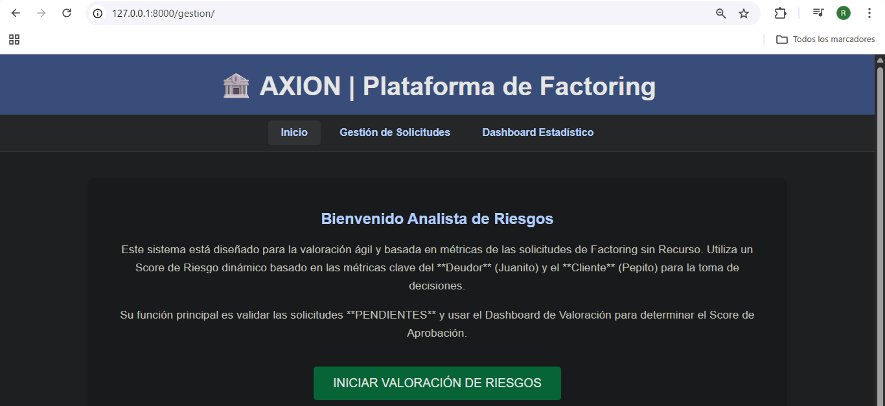
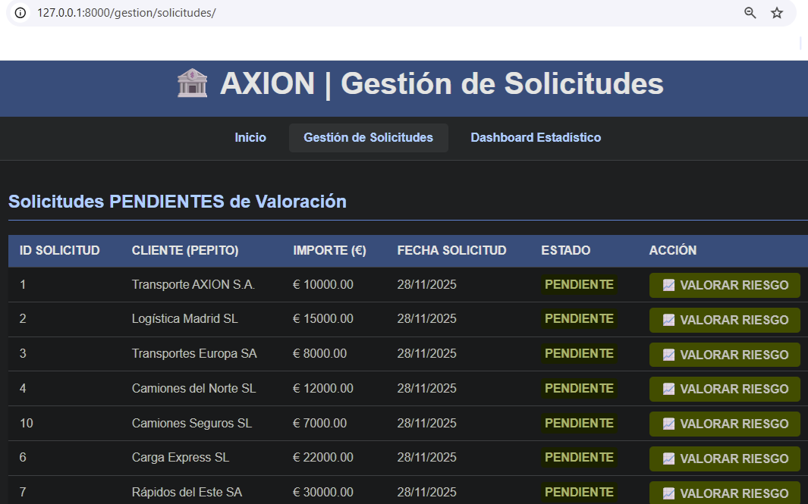
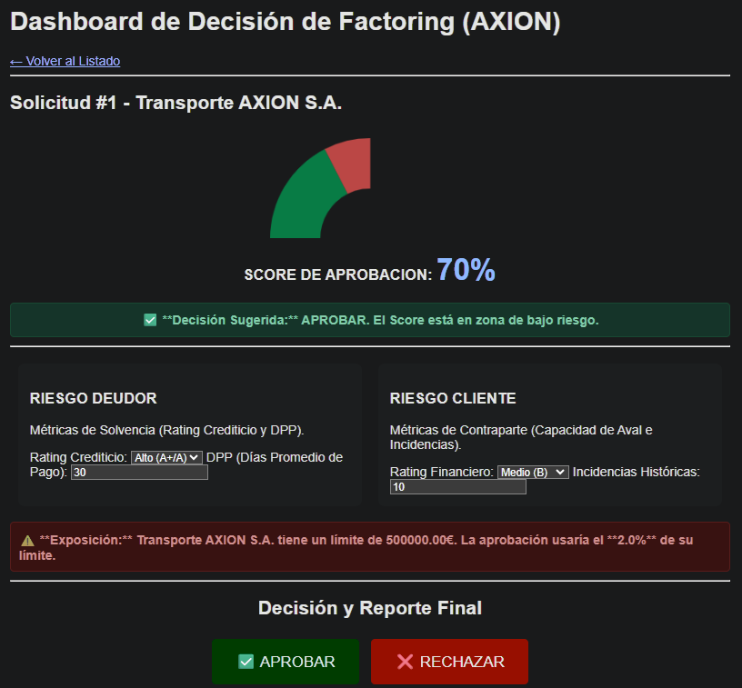
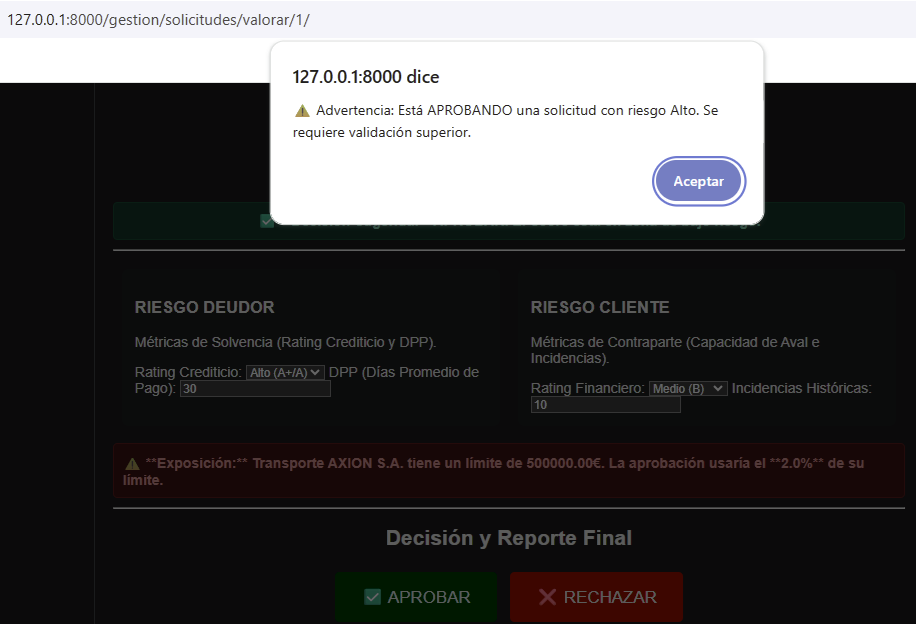

#  AXION | Sistema de Gestión de Riesgo y Factoring

##  Descripción del Proyecto
AXION es una plataforma financiera desarrollada en **Django** diseñada para gestionar el ciclo de vida de **Factoring sin Recurso**. El sistema permite a los analistas de riesgo evaluar solicitudes de adelanto de facturas mediante un algoritmo de scoring dinámico y ejecutar decisiones que impactan directamente en el Core Bancario (simulado en Oracle DB).

AXION-Plataforma


AXION-Gestion de Solicitudes


AXION-DashBoard de Evaluación de aprobación de Factoring.


AXION-Mensaje de alerta del Sistema de evaluación de Factoring.



Este proyecto demuestra la capacidad de integrar aplicaciones web modernas con bases de datos relacionales robustas y lógica de negocio compleja (PL/SQL).

##  Características Principales

* **Dashboard de Riesgo Interactivo:**
    * Cálculo de *Scoring* en tiempo real basado en métricas del Deudor (Rating Crediticio, DPP) y del Cliente (Incidencias, Capacidad de Aval).
    * Visualización gráfica con **Chart.js** (Gauge Chart) para la toma de decisiones rápida.
* **Arquitectura Híbrida:**
    * Uso de `cx_Oracle` para conectar Python con Stored Procedures en Oracle Database.
    * Gestión de transacciones segura (Commit/Rollback) desde la capa de aplicación.
* **Automatización Financiera:**
    * Cálculo automático de costes financieros e importes netos a abonar.
    * Validación de límites de crédito y exposición de deuda.

##  Tecnologías Utilizadas
* **Backend:** Python, Django Framework.
* **Base de Datos:** Oracle Database 11g/18c (PL/SQL, Triggers, Stored Procedures).
* **Frontend:** HTML5, CSS3, JavaScript (ES6), Chart.js.
* **Driver:** cx_Oracle.


##  Instalación y Configuración

1.  **Clonar el repositorio:**
    ```bash
    git clone [https://github.com/tu-usuario/axion-factoring.git](https://github.com/tu-usuario/axion-factoring.git)
    cd axion-factoring
    ```

2.  **Instalar dependencias:**
    ```bash
    pip install -r requirements.txt
    ```

3.  **Configurar Base de Datos:**
    * Asegúrate de tener una instancia de Oracle corriendo.
    * Configura las variables de entorno para `DB_USER` y `DB_PASSWORD`.

4.  **Ejecutar el servidor:**
    ```bash
    python manage.py runserver
    ```


Sobre la Autora: Ingeniera Industrial y Datos
Ingeniera con un enfoque sólido en la optimización de procesos y el diseño de sistemas de soporte para la toma de decisiones.
Este proyecto nace de la necesidad de digitalizar y robustecer la evaluación de riesgos en el sector de Factoring. Mi objetivo fue crear una arquitectura que no solo procese datos, sino que aplique reglas de negocio complejas de forma automatizada y segura.
www.linkedin.com/in/ruth-travezaño-557316257


